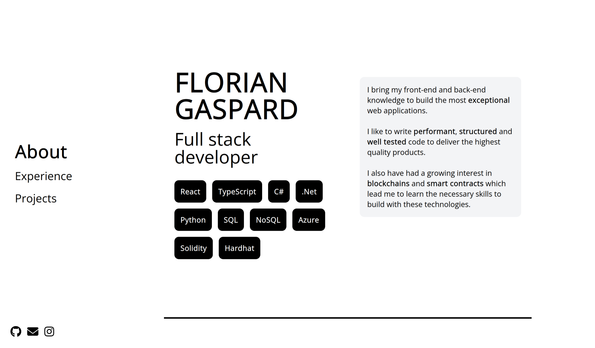

<div align="center">
  <a href="https://floriangaspard.com">
    
  </a>

  <h3 align="center">floriangaspard.com</h3>

  <p align="center">
    My personal website
    <br />
    <a href="https://floriangaspard.com">View online</a>
  </p>
</div>



Built with React + TypeScript + Vite and TailwindCSS.

# Installation

```
npm install
```

# Getting started

## Start development server

```
  npx vite
```

## Build and run

1. Build

```
  npm run build
```

1. Run build locally

```
  npm run preview
```

# Contact

floriangaspard.fg@gmail.com
